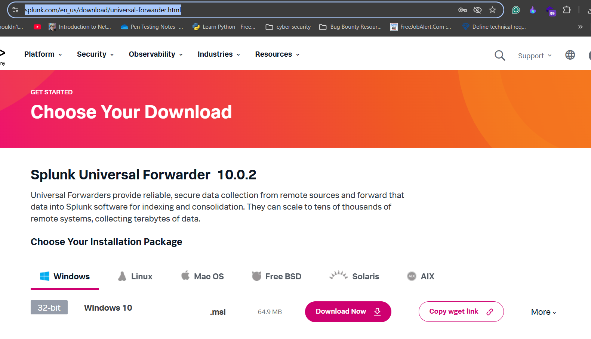
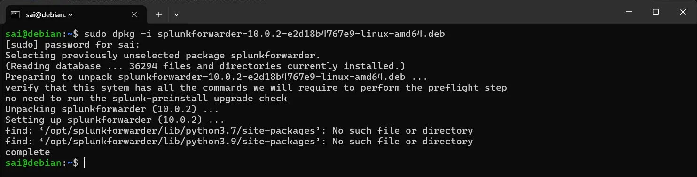

# 📘 Splunk Universal Forwarder Installation – Step-by-Step Documentation

Client: Where we install forwarder

Server: Splunk Dashboard

## **1️⃣ Download the Splunk Universal Forwarder**

1. Visit the official Splunk Universal Forwarder download page:
    
    [**splunk.com](https://www.splunk.com/en_us/download/universal-forwarder.html) → Download → Universal Forwarder**
    
2. Log in to your Splunk account.
    
    
    
3. Select the appropriate package.
    
    For Ubuntu/Debian → choose **Linux 64-bit .deb**.
    
    
    
4. Copy the download link.

---

## **2️⃣ Download the Forwarder on Your Linux System**

Use `wget` to download the `.deb` package:

Example Command

```bash
wget -O <splunkforwarder-file-linux.deb> "https://download.splunk.com/products/universalforwarder/releases/10.0.2/linux/splunkforwarder-file-linux-amd64.deb"
```


---

## **3️⃣ Install the Universal Forwarder**

```bash
sudo dpkg -i <splunkforwarder-file.deb>
```



---

## **4️⃣ Start Splunk Forwarder**

```bash
sudo /opt/splunkforwarder/bin/splunk start
```


✔ Accept the license agreement

✔ Set admin username and password


---

## **5️⃣ Configure Splunk Indexer (Server-side)**

In the **Splunk Web Dashboard**:

**Settings → Forwarding and Receiving → Configure Receiving → Add Port → 9997**


This opens port **9997** to receive data from forwarders.

---

## **6️⃣ Add the Forward Server (Client-side)**

On the machine where the forwarder is installed:

```bash
sudo /opt/splunkforwarder/bin/splunk add forward-server <SPLUNK-IP>:9997
```

Enter the Splunk username and password when prompted.


---

## **7️⃣ Add Log Monitoring**

To monitor system logs:

```bash
sudo /opt/splunkforwarder/bin/splunk add monitor /var/log
```


---

## **8️⃣ Restart the Forwarder**

```bash
sudo /opt/splunkforwarder/bin/splunk restart
```


---

## **9️⃣ Verify Logs in Splunk**

In the Splunk Dashboard **Search & Reporting**, run:

```
index="main"
```

You should now see logs flowing from the client system to Splunk.


