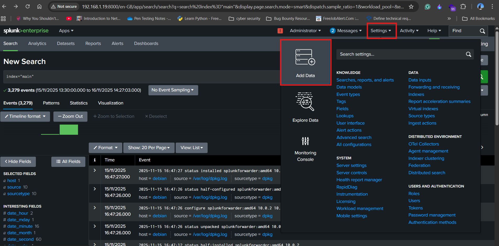
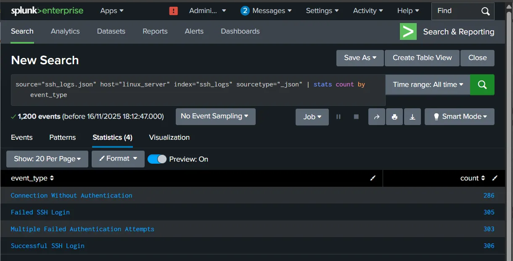
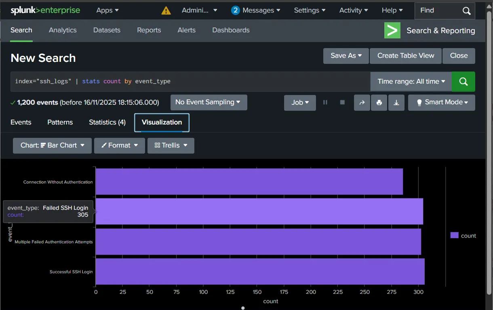
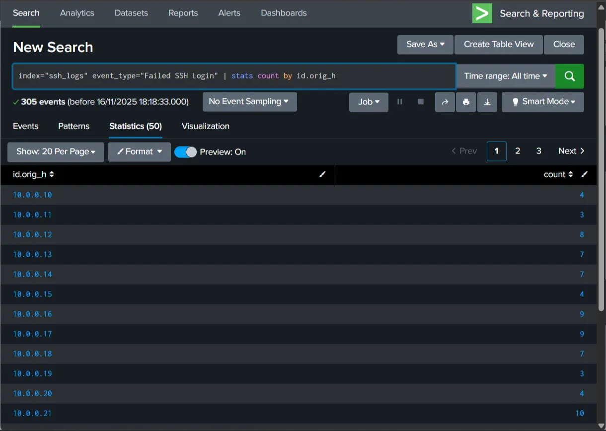
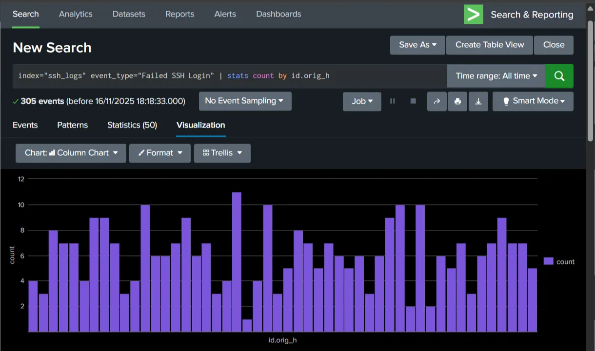

# SSH Log Analysis – Documentation

## **1. Introduction**

This document explains how to analyze SSH logs in Splunk, perform basic event investigation, detect brute-force attempts, and create alerts. The logs are provided in JSON format and indexed in Splunk for querying and analysis.

---

## **2. Uploading SSH Logs to Splunk**

### **Steps:**

1. Log in to the **Splunk Dashboard**.
2. Navigate to
    
    **Settings → Add Data → Upload**.
    
    
    
    
    
3. Upload the SSH log file (`ssh_logs.json`).
    
    
    
    
    
4. Create a new index
    
    
    
5. Set the following metadata:
    - **Source:** `ssh_logs.json`
    - **Host:** `linux_server`
    - **Index:** `ssh_logs`
    - **Sourcetype:** `_json`


---

## **3. Basic Queries for SSH Log Analysis**

### **View all logs**

```
source="ssh_logs.json" host="linux_server" index="ssh_logs" sourcetype="_json"
```


### **Count logs by event type**

```
index="ssh_logs" | stats count by event_type
```





This helps identify the number of failed logins, successful logins, and brute-force indicators.

---

## **4. Detecting Failed Logins**

### **Query – Count failed login attempts by source IP**

```
index="ssh_logs" event_type="Failed SSH Login"
| stats count by id.orig_h
```

This identifies IP addresses generating the most failed SSH login attempts.





---

## **5. Detecting Brute-Force Attempts**

### **Multiple failed authentication attempts**

```
index="ssh_logs" event_type="Multiple Failed Authentication Attempts"
| stats count by id.orig_h, id.resp_h
```

This shows top 10 attackers repeatedly hitting the SSH service on the target.


---

## **6. Detecting Successful Logins After Brute Force**

### **Successful SSH Logins**

```
index="ssh_logs" event_type="Successful SSH Login"
| stats count by id.orig_h, id.resp_h
```

If a successful login follows many failed attempts, it may indicate a **successful brute-force attack**.


---

## **7. Creating an Alert for Brute-Force Detection**

### **Steps to Create an Alert:**

1. Run the brute-force detection query.
2. Click **Save As → Alert**.
    
    
    
3. Enter an alert name (e.g., *SSH Brute Force Detector*).
    
    
    
4. Add a **Trigger Action**:
    - Email notification
    - Slack/Webhook message
    - Create an Incident (if using SOAR)

Here I am just triggering an alert in the dashboard


---

## **8. Summary**

With Splunk performed:

- SSH log ingestion
- Event type-based analysis
- Failed and successful login review
- Detection of brute-force patterns
- Creation of automated alerts for SOC monitoring

This workflow strengthens SSH monitoring and enhances defensive capabilities.
