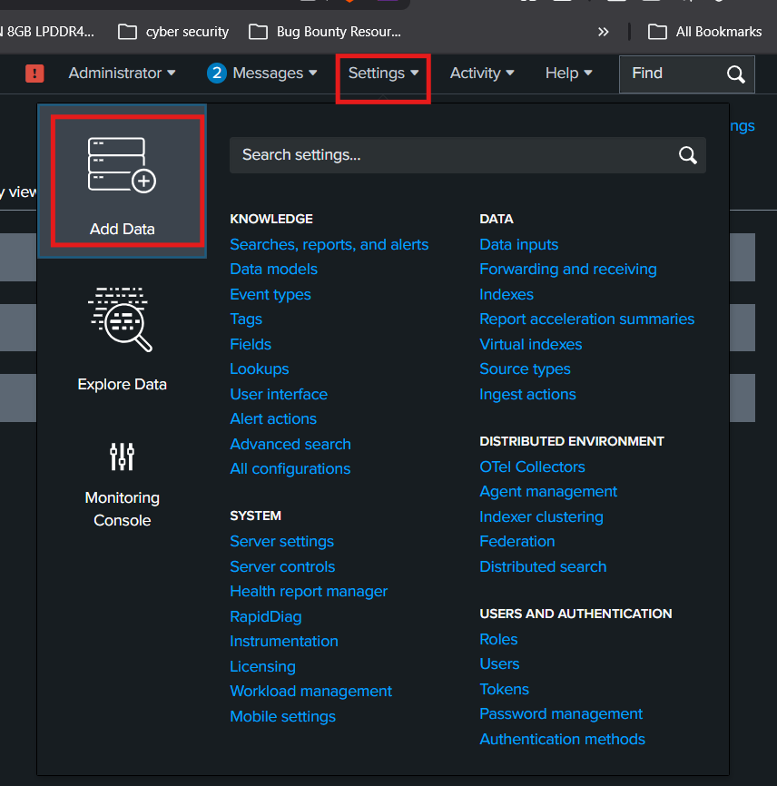

# SSH log analysis with dashboard

# Adding Data

- Settings → add data



- Click on upload


- Select the file


- Click on next then keep the source type default and next

 


- Change the hostname field to LinuxServer.
- Click next and start search.


- The logs are displayed


# Creating a dashboard

Click on the dashboards tab


Click on create new dashboards


Give a title and select classic dashboards and select create


## Creating a time range button

- Click on Add Input and Select Time


- Click on pencil icon Set Label to `Time Range` and Token `time_range`


- Again Add Input and Select Submit


- Save it


## **Overview Panels**

### Total SSH Events

- Click on Edit
- Click on Add Panel
- Under New, choose Single Value
- Use Shared Time Picker `time_range`
- Set Content Title to "Total SSH Events"
- Enter the Search String as below

```bash
source="ssh_logs_new.json" host="LinuxServer" sourcetype="_json"
 | stats count AS "Total SSH Events"
```


Successful Logins

Repeat the above steps change these values

- Set **Content Title** to `"Successful Logins"`
- Enter the **Search String** as below:

```bash
source="ssh_logs_new.json" host="LinuxServer" sourcetype="_json" event_type="Successful SSH Login" 
| stats count AS "Successful Logins"
```


### **Failed Logins**

Repeat the steps of Total SSH Events change these values

- Set **Content Title** to `"Failed Logins"`
- Enter the **Search String** as below:

```
source="ssh_logs_new.json" host="LinuxServer" sourcetype="_json" event_type="Failed SSH Login"
| stats count AS "Failed Login"
```


### **Connection without Authentication**

Repeat the steps of Total SSH Events change these values

- Set **Content Title** to `"Invalid User Attempts"`
- Enter the **Search String** as below:

```
source="ssh_logs_new.json" host="LinuxServer" sourcetype="_json" event_type="Connection Without Authentication" 
 | stats count AS "Connection Without Authentication"
```


## **Login Activity Trends Pannels**

### **Failed Logins by username**

- Click on **Add Panel**
- Under **New**, choose **Bar Chart**
- Use **Shared Time Picker** `time_range`
- Set **Content Title** to `"Failed Logins by username"`
- Enter the **Search String** as below:

```
source="ssh_logs_new.json" host="LinuxServer" sourcetype="_json" event_type="Failed SSH Login" | top username
```


### **Possible Brute Force**

- Click on Add Panel
- Under New, choose Statstics Table
- Use Shared Time Picker `time_range`
- Set Content Title to `Possible Brute Force IP Address`
- Enter the Search String as below:

```bash
source="ssh_logs_new.json" host="LinuxServer" sourcetype="_json" event_type="Multiple Failed Authentication Attempts" | top id.orig_h
```


## **Visualizing Brute Force attack in geo-location**

Visualizing Brute Force attack with geo-location

- Click on Add Panel
- Under New, choose Choropleth Map
- Use Shared Time Picker time_range
- Set Content Title to Brute Force attack with geo-location
- Enter the Search String as below:

```bash
source="ssh_logs_new.json" host="LinuxServer" sourcetype="_json" event_type="Multiple Failed Authentication Attempts" 
| table id.orig_h
| iplocation id.orig_h
| stats count by Country
| geom geo_countries featureIdField="Country"
```


After adding some colors the dashboard looks like this.


### References

- [https://haxcamp.com/projects/f9b81d66-d338-4b82-8faf-437222b5e325/resources](https://haxcamp.com/projects/f9b81d66-d338-4b82-8faf-437222b5e325/resources)
