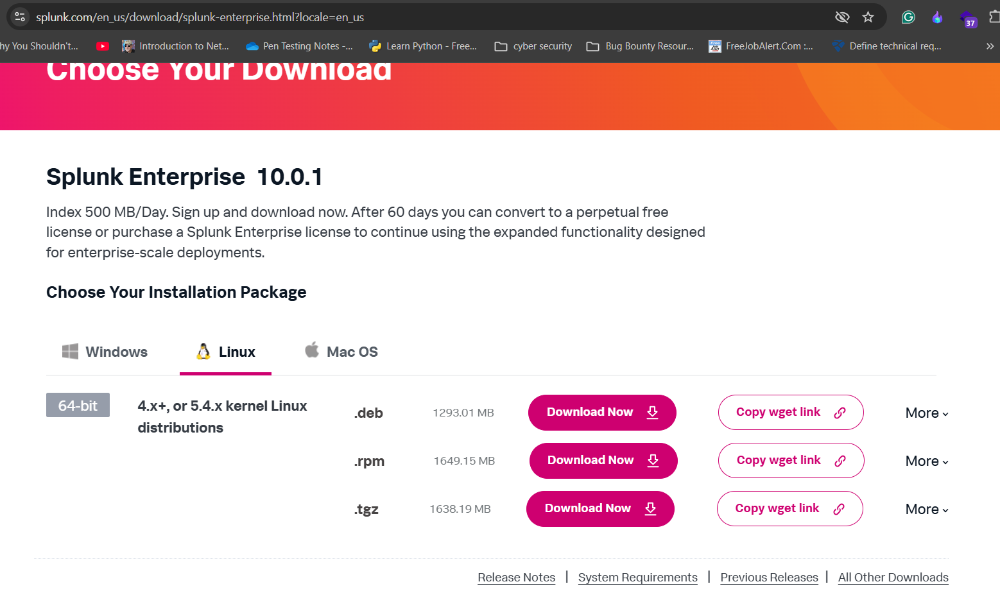

# Splunk Installation Guide

**Virtual Machine OS: Debian 13**

## **1. Update the System**

Before installing Splunk, update your system packages:

```bash
sudo apt update && sudo apt upgrade -y
```

---

## **2. Download Splunk Enterprise**

1. Visit the official Splunk download page:
    
    [**https://www.splunk.com/en_us/download/splunk-enterprise.html**](https://www.splunk.com/en_us/download/splunk-enterprise.html)
    
    
    
2. Log in and copy the **wget** link of the `.deb` installer for Linux (amd64).

Example command:

```bash
wget -O <splunk-file-linux-amd64>.deb "https://download.splunk.com/products/splunk/releases/10.0.1/linux/splunk-file-linux-amd64.deb"
```


---

## **3. Install Splunk**

Run the following command to install:

```bash
sudo dpkg -i <splunk-file-name>.deb
```

---

## **4. Start Splunk Service**

Navigate to the Splunk binary folder:

```bash
cd /opt/splunk/bin/
```

Start Splunk:

```bash
sudo ./splunk start
```

Accept the license agreement and create your **admin username & password**.


---

## **5. Allow Splunk Web Access**

Edit Splunk configuration:

```bash
sudo nano /opt/splunk/etc/splunk-launch.conf
```

Add the following line:

```
SPLUNK_BINDIP=0.0.0.0
```

This allows Splunk Web to be accessed from any IP.


---

## **6. Access Splunk Dashboard**

Open your browser:

```
http://<SPLUNK-IP>:8000
```

Log in with your created credentials.


