# **File Integrity Monitoring**

File Integrity Monitoring (FIM) is an essential component of modern cybersecurity practices. It enables you to detect unauthorized changes to critical files and directories. This guide will walk you through configuring FIM on Wazuh, a powerful open-source security platform.

### **Prerequisites**

- A functional Wazuh server setup.
- Ubuntu client machine with agent installed.
- Administrator or root privileges on both the server and client machine.

### **Step 1: Access the Wazuh Dashboard**

- Open the Wazuh Dashboard in your browser.
- Navigate to **Endpoint Security** > **File Integrity Monitoring** from the options menu.
    
    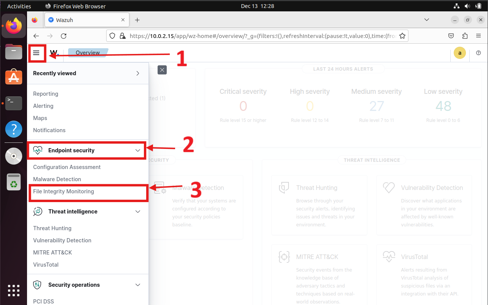
    
- Under the **Inventory** section, select the agent you desire for FIM.

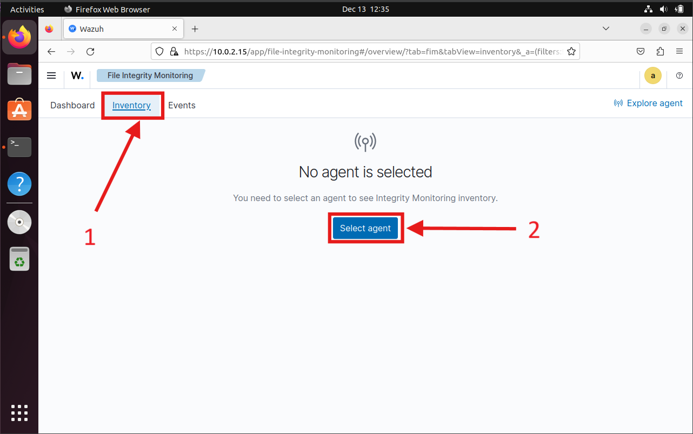

- Now select your agent shown in the list.

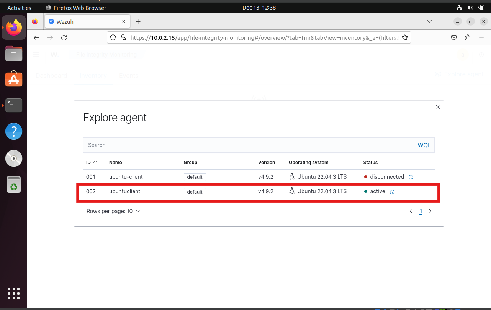

- Review the default files and directories monitored by Wazuh.

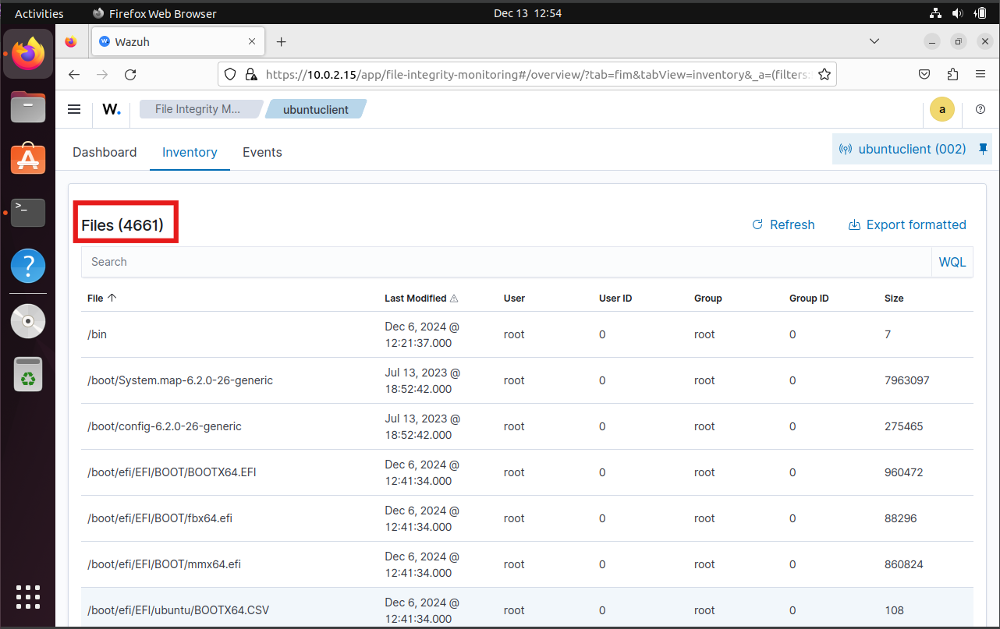

### **Step 2: Modify the `ossec.conf` File on the Client Machine**

To monitor additional files or directories, update the `ossec.conf` file on the client machine

1. **Switch to Root User:**

```bash
sudo su

```

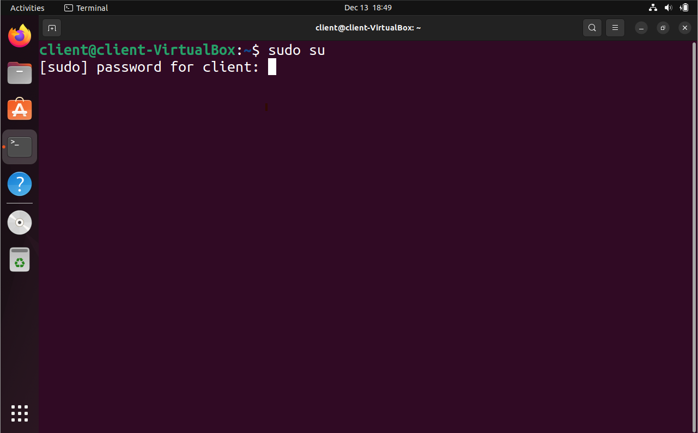

2. **Backup the Configuration File:** Before making changes, create a backup of the existing configuration

```bash
cp /var/ossec/etc/ossec.conf /var/ossec/etc/ossec.backup.conf
```

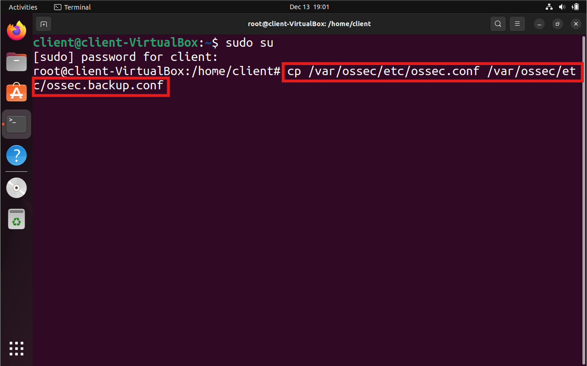

3. **Edit the `ossec.conf` File:** Use your preferred text editor to edit the file. For this example, we’ll use

```bash
nano /var/ossec/etc/ossec.conf
```

4. **Locate the File Integrity Block:** Press `Ctrl + W` in `nano` and search for **File integrity monitoring**.

5. **Add a Custom Directory:** For instance, to monitor a directory named `test` in the home directory:

```bash
<directories realtime="yes">/home/client/test</directories>
```

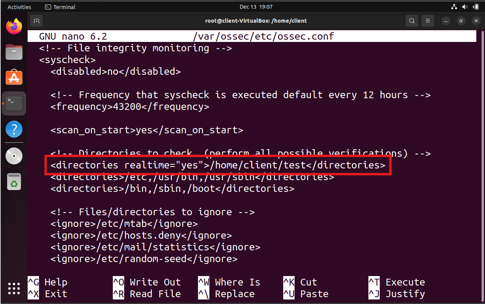

Add the above line like this.

```bash
<!-- File integrity monitoring -->
<syscheck>
	<disabled>no</disabled>
	<!-- Frequency that syscheck is executed, default every 12 hours -->
	<frequency>43200</frequency>
	<scan_on_start>yes</scan_on_start>
	<!-- Directories to check (perform all possible verifications) -->
	<directories>/etc,/usr/bin,/usr/sbin</directories>
	<directories>/bin,/sbin,/boot</directories>
	<directories realtime="yes">/home/client/test</directories>
</syscheck>
```

6. **Save and Exit:**

- Press `Ctrl + O` to save the file.
- Press `Ctrl + X` to exit.

### **Step 3: Restart the Wazuh Agent**

To apply the changes, restart the Wazuh agent:

```bash
systemctl restart wazuh-agent
```

### **Step 4: Test File Integrity Monitoring**

Exit from the root.

```bash
exit
```

Add or modify files in the monitored directory:

```bash
mkdir test
touch test/sample.txt
echo "Test file for FIM" >> test/sample.txt
```

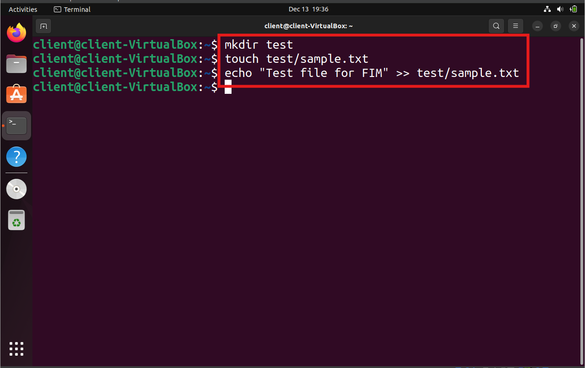

Go to the **File Integrity Monitoring** section on the Wazuh Dashboard view the events sections.

Check for alerts indicating that files were added or modified in `/home/client/test`.

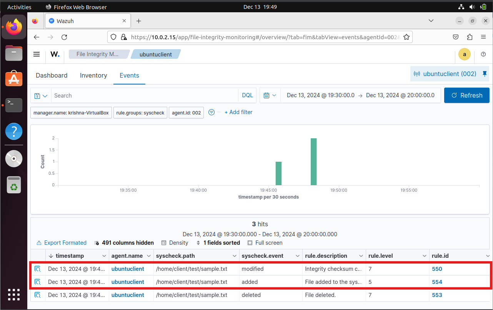

# **VirusTotal Integration**

VirusTotal is a service that analyzes suspicious files, domains, IPs, and URLs to detect malware and other breaches and automatically shares results with the security community.

### **Step 1: Getting the API Key from VirusTotal**

1. Go to the [VirusTotal website](https://www.virustotal.com/).

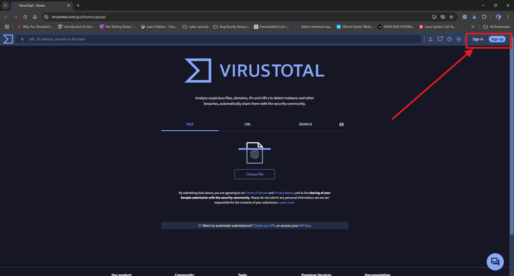

2. Sign up or sign in to your VirusTotal account.

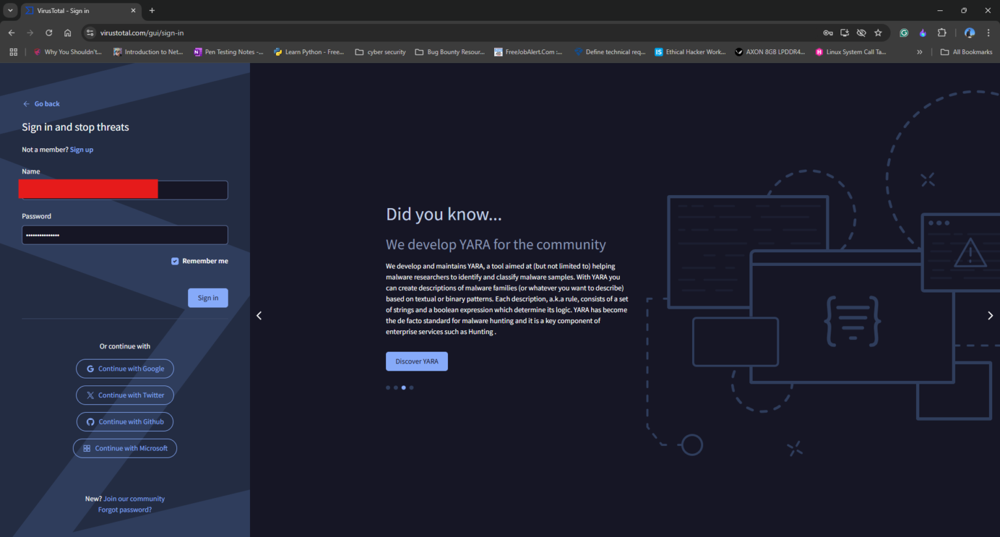

3. In the **Account** section, navigate to the **API** key section.

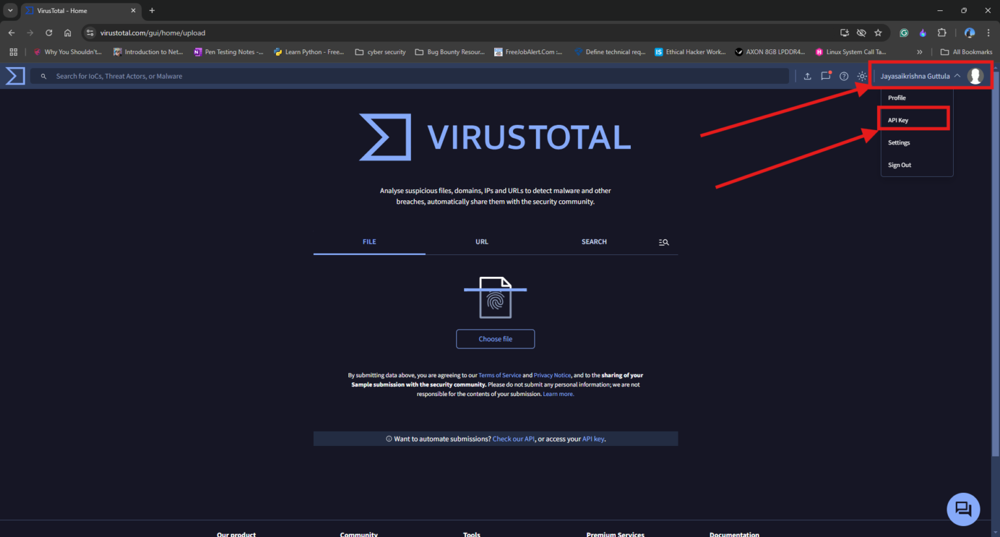

4. Copy the API key and store it in a safe place for later use.

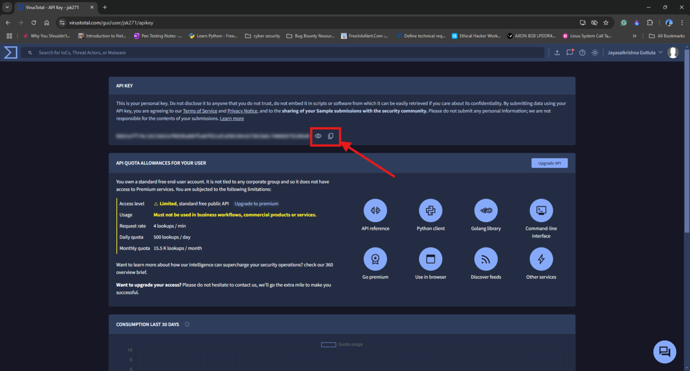

### **Step 2: Integrate the VirusTotal API with Wazuh**

1. Open the server machine and edit the `ossec.conf` file:

```bash
sudo nano /var/ossec/etc/ossec.conf
```

2. Add the following block to integrate VirusTotal at the start or end of the file, replacing `<VIRUSTOTAL_API_KEY>` with your actual API key:

```bash
<integration>
 <name>virustotal</name>
 <api_key><VIRUSTOTAL_API_KEY></api_key>
 <group>syscheck</group>
 <alert_format>json</alert_format>
</integration>
```

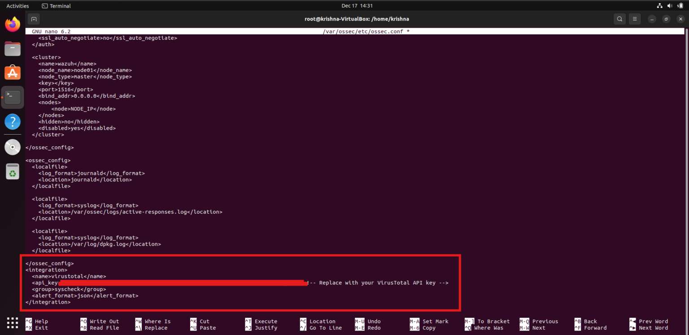

3. Save the file (`Ctrl + O` and `Ctrl + X`) and restart the Wazuh server:

```bash
systemctl restart wazuh-manager
```

With this integration, Wazuh will automatically analyze files flagged by File Integrity Monitoring using VirusTotal, enhancing your ability to detect malware and security breaches.

### **Reference Links:**

- Wazuh Documentation: https://documentation.wazuh.com/current/getting-started/use-cases/file-integrity.html
- Virustotal Integration: https://documentation.wazuh.com/current/user-manual/capabilities/malware-detection/virus-total-integration.html
